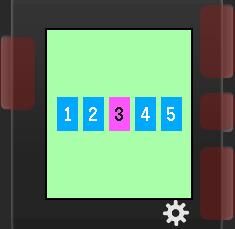

# Digit input for PebbleJS

Simple library that gives you a window (`UI.Window`) with several input fields
for digits, and allows the user to input any number they desire.

## User interface

This works in the same way as Timer app input in the Pebble Time (I don't have
Pebble OG nor PTR to check how it works there, sorry!) - user can manipulate
particular digit with up/down buttons, move forward with select button, and
go backward a digit with back button.

## Usage

`digit-input` module exposes single function - `digitInput`, which takes two
params: `options` (an object) and `callback` (a function), and returns
ready-to-display `UI.Window` object. Moreover, as this is a standard `Window`,
you can add further elements to it.

```js
var digitInput = require('digit-input.js').digitInput;

var options = { ... };
var input = digitInput(options, function (result) {
    console.log('Result is: ' + result);
});
input.show();
```

Note: this window won't hide automatically after calling `callback`, so it's
your responsibility to do so.

### Options

- `backgroundColor`: background color of the window (default: `mintGreen`)
- `fieldTextColor`: color of normal (not selected) digit (default: `white`)
- `fieldBackgroundColor`: background color of normal (not selected) field (default: `vividCerulean`)
- `selectedFieldBackgroundColor`: background color of currently selected field (default: `shockingPink`)
- `selectedFieldTextColor`: color of currently selected digit (default: `black`)
- `count`: number of inputs to show (default: `5`)
- `defaultValue`: initial value for all fields (default: `0`)
- `font`: font to be used (default: `gothic-24-bold`)


## Screenshot



## Todo

- fancy animations

## License

See [LICENSE.md](LICENSE.md).
